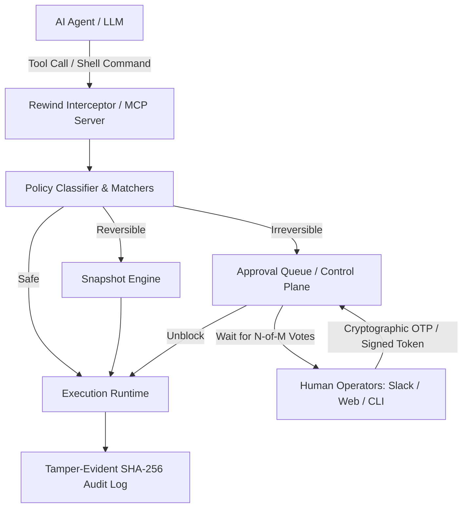

# Architecture & Design Principles

Rewind acts as an enforced barrier between autonomous AI agents and execution runtimes (shell environments, databases, cloud APIs, containers).

---

## 1. Core Principles

### Fail Closed Everywhere
* Unknown actions, unrecognized tools, unparseable SQL/shell syntax, unreadable policy files, failed webhook notifications, or expired approval requests **never default to allow**.
* When in doubt, Rewind assigns `RiskClass.IRREVERSIBLE` or holds the action for explicit approval.

### Separation of Duties (SoD)
* The agent session initiator cannot approve their own high-risk actions.
* Approvals require independent consensus (any-one or N-of-M approvers with `admin` or `approver` roles).

### Action Hash Binding
* Approval tokens and human votes are cryptographically bound to the SHA-256 hash of the exact tool, operation, and parameters:
  $$\text{Hash} = \text{SHA256}(\text{tool} \parallel \text{operation} \parallel \text{canonical\_json}(\text{payload}))$$
* If an agent modifies arguments between request and execution (e.g. changing `WHERE id = 5` to `WHERE 1 = 1`), the hash changes, invalidating any issued approval code.

---

## 2. Contracts and Interoperability

All modules code against strict interfaces defined in `rewind.contracts`:

* **`RiskClass`**: `safe` < `reversible` < `irreversible`
* **`ActionRequest`**: Canonical payload representation of an intercepted action.
* **`Classification`**: Contains risk class, matched rule ID, pack name, human-readable reason, and snapshot requirements.
* **`Classifier` (Protocol)**: Evaluates an `ActionRequest` and returns a `Classification`.
* **`SnapshotBackend` (Protocol)**: Captures state before reversible operations and performs restorations.
* **`AuditLog` (Protocol)**: Append-only event ledger secured by a SHA-256 hash chain ($H_i = \text{SHA256}(H_{i-1} \parallel \text{entry}_i)$).
* **`TokenBroker` (Protocol)**: Issues and revokes short-lived, single-use execution tokens.

---

## 3. Policy Engine Matchers

Rewind avoids naive substring or regular expression matching:

* **SQL Matcher (`sqlglot`)**: Parses queries into abstract syntax trees (ASTs). Distinguishes `SELECT`, `INSERT`, `UPDATE`, `DELETE`, and `DROP`. Inspects CTEs (`WITH ... AS (...)`) for embedded writes, detects `EXPLAIN ANALYZE` execution, and correctly matches unqualified table names.
* **Shell & FS Matcher (`shlex`)**: Tokenizes shell commands, recurses through execution wrappers (`sudo`, `env`, `xargs`, `sh -c`, `eval`, `find -exec`), and evaluates canonical filesystem paths.
* **Cloud & Container Matchers**: Inspect AWS CLI / boto3 actions and Docker commands (`docker system prune`, `docker compose down -v`, `docker volume rm`).

---

## 4. Control Plane & Team Architecture

* **SQLite WAL Store**: Fast, thread-safe transactional store with atomic `BEGIN IMMEDIATE` transactions for concurrent voting.
* **FastAPI Dashboard**: Modern HTMX-powered dashboard providing live queue management, session start/end, audit verification, and user administration.
* **Multi-Channel Dispatcher**: Dispatches notifications to Webhooks, Slack, Discord, and Email with exponential backoff, rate limiting, and de-duplication.
